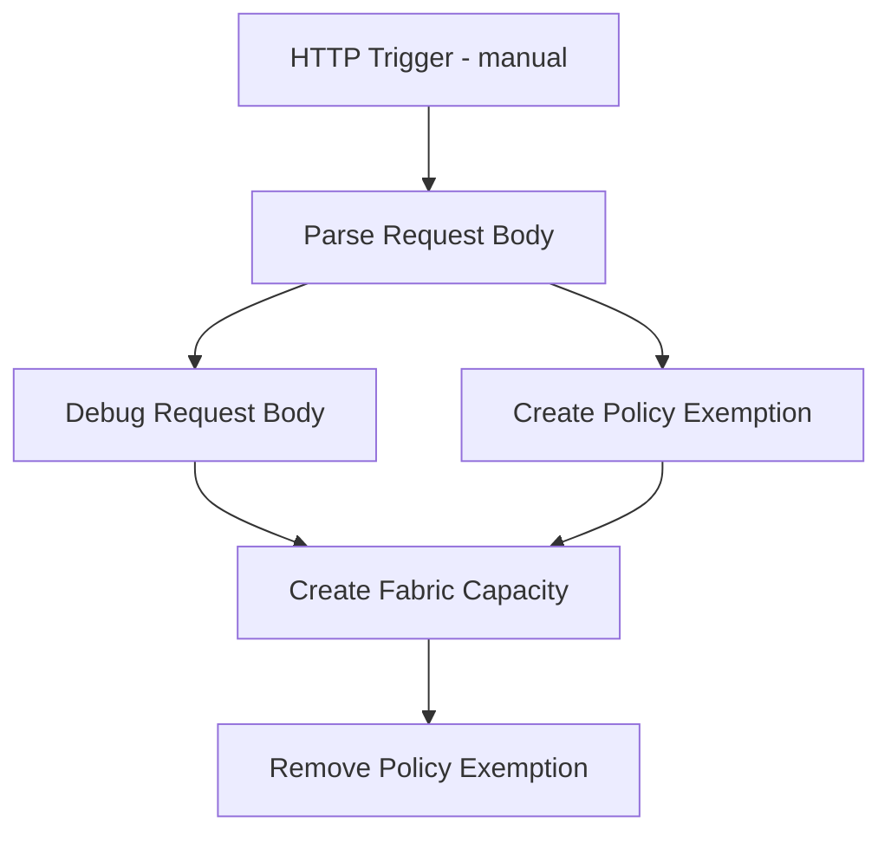

# Simplified Logic App Design for Fabric Capacity Provisioning

## Overview
This document describes the simplified Logic App workflow used to provision Microsoft Fabric capacity with a short-lived policy exemption. The implementation mirrors `infra/logic-apps/fabric-capacity-approval-workflow-simplified.json` and is intended for operators who will deploy or maintain the Logic App.

## Architecture Components

### Workflow Structure (actions & ordering)


The workflow actions (exact names used in the JSON):
- `Parse_Request_Body` — ParseJson action that validates and extracts inputs from the trigger body
- `Create_Policy_Exemption` — PUT call to create a temporary `Microsoft.Authorization/policyExemptions` resource
- `Debug_Request_Body` — Compose action that builds the Fabric capacity request body (used for the PUT)
- `Create_Fabric_Capacity` — PUT call to create `Microsoft.Fabric/capacities` with the composed body
- `Remove_Policy_Exemption` — DELETE call to remove the temporary exemption after provisioning succeeds

### Key behavior notes
- The exemption name is created as `temp-exempt-@{workflow()?['run']['name']}` so it is unique per Logic App run.
- The exemption expires automatically (the template sets `expiresOn` to `addMinutes(utcNow(), 15)`), and the workflow also explicitly deletes it after a successful capacity creation.
- The HTTP actions authenticate using `ManagedServiceIdentity` (system-assigned managed identity).

## Input Schema
The HTTP trigger expects a JSON object with the following properties (the schema is enforced by the `ParseJson` action):

```json
{
    "subscriptionId": { "type": "string", "description": "Azure Subscription ID" },
    "resourceGroup": { "type": "string", "description": "Target resource group name" },
    "location": { "type": "string", "description": "Azure region (e.g., eastus)" },
    "capacityName": { "type": "string", "description": "Fabric capacity name" },
    "skuName": { "type": "string", "description": "Fabric SKU (e.g., F2, F4, F8)" },
    "adminMembers": { "type": "string", "description": "Comma-separated UPNs or Service Principal objectIds" },
    "policyAssignmentId": { "type": "string", "description": "Resource ID of the policy assignment to exempt" }
}
```

Notes on fields:
- `adminMembers` is supplied as a comma-separated string and later converted to the administration members list in the Compose action.
- `capacityName` must conform to service naming rules; the JSON schema includes a human-friendly description but does not enforce regex-based name validation.

## Implementation Details

### Authentication & Permissions
- The Logic App uses its system-assigned managed identity for HTTP calls to the Azure Management API.
- Required RBAC roles for the identity (minimum):
    - `Policy Exemption Contributor` (or a role that permits creating/deleting `policyExemptions`)
    - `Contributor` or `Fabric Administrator` role on the target resource group/subscription for creating Fabric capacities

### Policy Exemption creation
- HTTP method: PUT
- URI pattern:
    `https://management.azure.com/subscriptions/{subscriptionId}/resourceGroups/{resourceGroup}/providers/Microsoft.Authorization/policyExemptions/temp-exempt-{runName}?api-version=2020-07-01-preview`
- Body (properties used):
    - `policyAssignmentId` — provided by caller
    - `exemptionCategory` — `Waiver`
    - `expiresOn` — `addMinutes(utcNow(), 15)` (15-minute short-lived exemption)
    - `displayName` — human-friendly label

Example (conceptual):
```json
{
    "properties": {
        "policyAssignmentId": "<policy-assignment-id>",
        "exemptionCategory": "Waiver",
        "expiresOn": "<utcNow + 15 minutes>",
        "displayName": "Temp exemption for Fabric capacity provisioning"
    }
}
```

### Fabric Capacity creation
- HTTP method: PUT
- URI pattern:
    `https://management.azure.com/subscriptions/{subscriptionId}/resourceGroups/{resourceGroup}/providers/Microsoft.Fabric/capacities/{capacityName}?api-version=2022-07-01-preview`
- The request body is composed by the `Debug_Request_Body` Compose action and contains:
    - `sku`: { `name`: `skuName`, `tier`: `Fabric` }
    - `properties.administration.members`: a list constructed from the `adminMembers` string
    - `location`: the Azure region

Example composed body (conceptual):
```json
{
    "sku": { "name": "F4", "tier": "Fabric" },
    "properties": { "administration": { "members": ["user@contoso.com"] } },
    "location": "eastus"
}
```

### Cleanup
- After the `Create_Fabric_Capacity` action succeeds, the `Remove_Policy_Exemption` action issues a DELETE to the same exemption resource using the same naming pattern. This ensures the temporary exemption is removed promptly in addition to the `expiresOn` value.

## Setup Instructions

1. Create a Logic App (Consumption) and open Code View.
2. Paste the JSON from `infra/logic-apps/fabric-capacity-approval-workflow-simplified.json`.
3. Enable the Logic App's system-assigned managed identity and grant the identity the RBAC roles noted above.
4. Save and test with a POST to the trigger URL.

## Usage Example
POST to the Logic App trigger with a JSON body (example):

```http
POST https://<logic-app-url>/triggers/manual/invoke?api-version=2016-10-01
Content-Type: application/json

{
    "subscriptionId": "00000000-0000-0000-0000-000000000000",
    "resourceGroup": "fabric-rg",
    "location": "eastus",
    "capacityName": "fabriccapacity001",
    "skuName": "F4",
    "adminMembers": "user@contoso.com",
    "policyAssignmentId": "/subscriptions/.../providers/Microsoft.Authorization/policyAssignments/..."
}
```

## Error Handling & Observability
- The schema enforces basic input validation. Failures in HTTP actions return status codes from the Azure Management API; consider adding retry policies or scope-level error handling if you expect transient failures.
- Ensure diagnostic settings and activity log alerts are enabled for the Logic App and the subscription (monitor creation/deletion of policyExemptions and Fabric capacities).

## Best Practices
- Keep the exemption window as small as possible (the workflow uses 15 minutes).
- Ensure the managed identity follows least privilege principles.
- Consider adding an approval step or automated guardrails (tags or naming policies) for production workflows.

## Limitations
- The current workflow is manually triggered (no built-in approval step).
- No email/Teams notifications are included.
- Basic error handling; add retries or compensating actions as needed.

## Next Steps
- Add an approval/automation step upstream (e.g., GitHub Issues -> approval -> trigger).
- Harden error handling and add retry/backoff.
- Add monitoring dashboards for exemption usage and provisioning success rates.